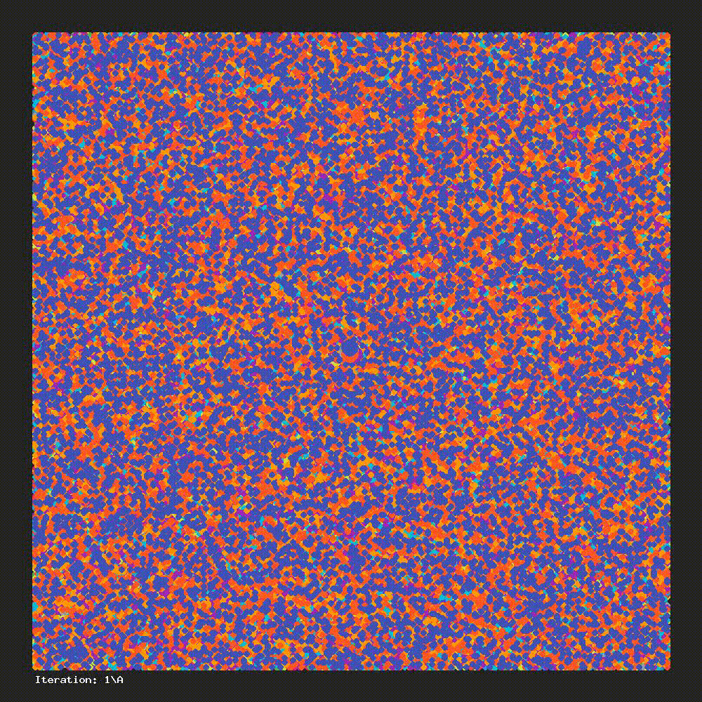

# PAI

PHP-AI is a simple project built to learn AI/Machine Learning. This project may or may not be developed further.


*K-means clustering, k=19, n=200000, gif made with ImageSubscriber and FFmpeg*

## Requirements

- PHP 7.4+
- GD library (only if you want to use the image generation feature)

## Setup

If you want just to check examples, you can run those commands:

```console
foo@bar:~$ git clone https://github.com/mariuszsienkiewicz/PAI.git PAI
foo@bar:~$ cd PAI
foo@bar:~$ composer dumpautoload
```

and then after going to the `examples` folder you can get into the folder that contains the algorithm interesting to you and then run the `example.php` code:

```console
foo@bar:~$ php example.php
```

## Usage

- [K Nearest Neighbors](examples/KNN/example.php)
- [K-means clustering](examples/KMeans)
