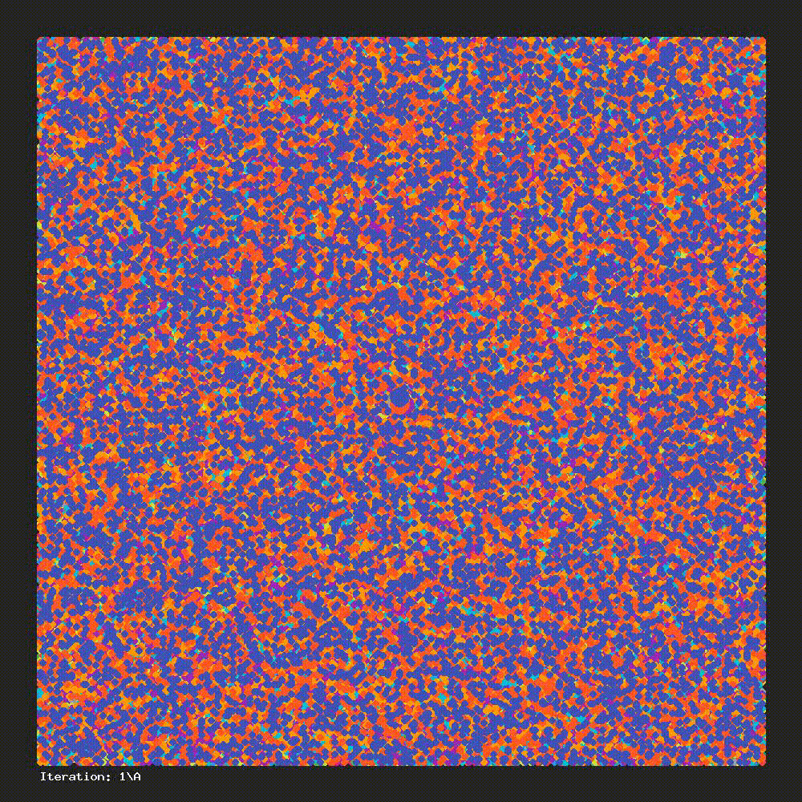

# k-means clustering

*k-means clustering is a method of vector quantization, originally from signal processing, that aims to partition n observations into k clusters in which each observation belongs to the cluster with the nearest mean (cluster centers or cluster centroid), serving as a prototype of the cluster. This results in a partitioning of the data space into Voronoi cells.* - Wikipedia


*k=19, n=200000*

# Requirements

- **PHP 7.4+**
- *GD library (only if you want to use the image generation feature)*

# Usage 

Simple setup to get clusters as an array:

```php
<?php

require __DIR__ . '/vendor/autoload.php';

use Mariuszsienkiewicz\KMeans\KMeans;

// random data
$minVal = 1;
$maxVal = 300;
for ($i = 0; $i < 200; $i++) {
    $points[] = [
        rand($minVal, $maxVal),
        rand($minVal, $maxVal),
    ];
}

// initialize the KMeans object and use 3 clusters
$kmeans = new KMeans(3);

// group the data into clusters in 10 iterations
$clusters = $kmeans->cluster($points);
```

## Image snapshot of each step

There is a possibility to get the snapshot (image) of each step:

```php
<?php

# autoload etc.

use Mariuszsienkiewicz\KMeans\Subscriber\ImageSubscriber;

$kmeans = new KMeans(10);

// subscriber initialization
$imageSubscriber = new ImageSubscriber($path, $imgWidth, $imgHeight, $minVal, $maxVal);

// basic setup, points and centroids size 
$imageSubscriber->setPointSize(6);
$imageSubscriber->setCentroidSize(24);

// attach subscriber to be notified about events
$kmeans->attach($imageSubscriber);
```

Currently it's possible to color 19 clusters with different colors, if you need more (or you want to override some colors) then you can do it this way:

```php
<?php

# autoload etc.

$colors = [
    1 => [244, 67, 54], // cluster with index 1 will get this color (default color will be overridden)
    20 => [222, 222, 123] // new color for cluster with index 20
];

$imageSubscriber = new ImageSubscriber($path, $imgWidth, $imgHeight, $minVal, $maxVal, $colors);
```

You can define your own subscriber using this interface: `Mariuszsienkiewicz\KMeans\Subscriber\SubscriberInterface`.
